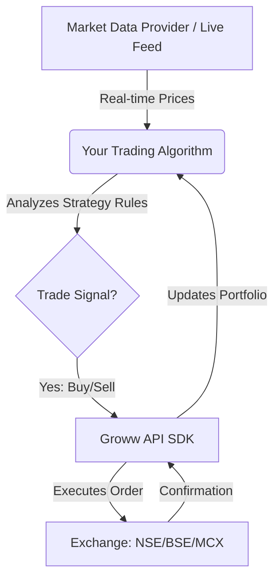

# Algorithmic Trading Guide - Groww API

Welcome to your algorithmic trading guide! This document explains how algorithmic trading works, lists daily command usage (from beginner to advanced), and highlights crucial safety precautions and risks.

---

## 1. How Algorithmic Trading Works

Algorithmic trading uses computer programs to automate the process of buying and selling financial instruments based on a set of rules (algorithms). Rather than manually placing trades through a web interface or mobile app:



### The 4 Pillars of an Algo Workspace:
1. **Authentication:** Dynamically logging in and keeping access active (using TOTP).
2. **Data Fetching:** Getting current prices, historical data (candles), and depth (order book).
3. **Execution:** Placing orders (Market, Limit, Stop Loss), modifying active orders, or cancelling.
4. **Risk & Capital Management:** Checking margins, monitoring open positions, and preventing loss.

---

## 2. Daily Commands & Workflow

Here is your daily operational checklist, ordered by complexity:

### Beginner: Daily Login & Verification
Before executing any strategies, verify that your API session is active.
```bash
# 1. Activate your virtual environment (run from terminal in d:\Quant)
venv\Scripts\activate

# 2. Run the authentication notebook to check session status
jupyter notebook notebooks/01_authentication.ipynb
```
*In Python, you can test basic connection via:*
```python
from src.groww_helper import GrowwHelper
groww = GrowwHelper.get_api_client()
print("Available margin:", groww.get_margin())
```

### Intermediate: Fetching Market Data & Analytics
Running scans, calculating technical indicators, and selecting stocks to trade.
```python
# Fetch current market price (LTP) or candles (historical data)
import pandas as pd

# Fetch historical data (Example command)
candles = groww.get_historical_data(symbol="SBIN", interval="1d", from_date="2026-06-01")
df = pd.DataFrame(candles)
print(df.head())
```

### Advanced: Auto-execution Loop
Running a live loop that polls prices and automatically sends buy/sell orders.
```python
import time

# Basic trading loop example (run with extreme caution!)
while True:
    ltp = groww.get_live_price("SBIN")
    if ltp < 800.00:
        # Place buying order
        order = groww.place_order(symbol="SBIN", transaction_type="BUY", quantity=1, price=ltp, order_type="LIMIT")
        print("Buy order placed:", order)
        break
    time.sleep(1) # Poll every 1 second
```

---

## 3. Crucial Rules & Cautions

Algo trading executes orders in milliseconds. A small bug can wipe out an account quickly. **Always follow these rules:**

> [!CAUTION]
> **API Rate Limits:** Groww limits the number of requests you can make per minute. If you poll prices too fast in a `while True` loop without a `time.sleep()`, your API key may get blocked, or your program will crash. Always implement throttling.

> [!WARNING]
> **Limit vs. Market Orders:** Avoid using **Market Orders** in illiquid stocks or F&O contracts. High slippage can cause execution at unexpected prices. Use **Limit Orders** to guarantee the execution price.

> [!IMPORTANT]
> **Keep Credentials Safe:** Never commit your `.env` file containing the TOTP secret or JWT token to GitHub or share it online. It gives full trading access to your account.

### Operational Safety Checklist
- [ ] **Paper Trade/Dry Run First:** Print your buy/sell signals to the terminal instead of executing them live on the exchange to verify logic.
- [ ] **Define a Maximum Loss Limit:** Programmatically stop the algorithm if daily loss exceeds a set threshold.
- [ ] **Kill Switch:** Always design a simple keyboard shortcut (`Ctrl+C`) or script to instantly cancel all pending orders and exit positions if things go wrong.
